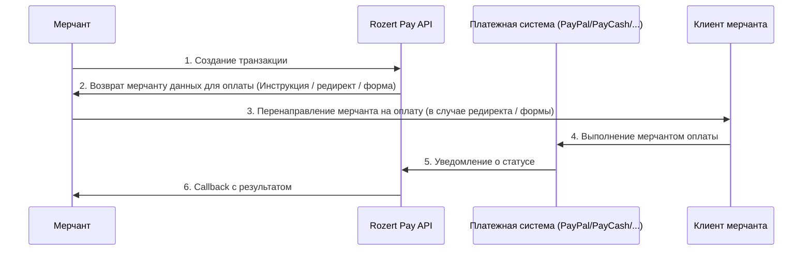

# Rozert Pay API Documentation

## Обзор

### [АПИ документация](https://ps-stage.rozert.cloud/redoc/public)

Rozert Pay - это платежный API, который позволяет мерчантам интегрировать различные платежные методы в свои
приложения. API поддерживает депозиты и выводы средств через различные платежные системы.

Доступные платежные системы:

* [Paypal](https://ps-stage.rozert.cloud/redoc/public/#tag/PayPal)
* [PayCash](https://ps-stage.rozert.cloud/redoc/public/#tag/PayCash)

## Базовый флоу взаимодействия



### 1. Создание транзакции

Мерчант создает транзакцию, указывая:
- Тип транзакции (депозит/вывод)
- Сумму и валюту
- ID кошелька
- Данные пользователя (для PayPal)
- URL для перенаправления после оплаты
- URL для получения уведомлений о статусе

### 2. Возврат мерчанту данных для оплаты

В зависимости от платежной системы, API возвращает:

- Данные формы для перенаправления пользователя. [См. поле form](https://ps-stage.rozert.cloud/redoc/public/#tag/Transactions/operation/transaction_retrieve).
  Например так работает Paypal
- Инструкции для оплаты (например PayCash). [См поле instruction](https://ps-stage.rozert.cloud/redoc/public/#tag/Transactions/operation/transaction_retrieve).
- Информацию о созданной транзакции

### 3. Callback уведомления

Rozert Pay отправляет уведомления о статусе транзакции на указанный callback URL. Основные статусы:
- `pending` - Транзакция в процессе
- `success` - Транзакция успешно завершена
- `failed` - Транзакция отклонена
- `refunded` - Транзакция возвращена

## Основные компоненты API

### [АПИ документация](https://ps-stage.rozert.cloud/redoc/public)

### Аутентификация

API использует HMAC-аутентификацию для защиты запросов. Для каждого запроса необходимо передавать следующие заголовки:
- `X-Merchant-Id` - ID мерчанта
- `X-Signature` - HMAC подпись запроса

Пример HMAC подписи:

```python
import base64
import hashlib
import hmac


def sign_request(request_body: str, secret: str) -> str:
    secret_key = secret.encode()
    message = request_body
    signature = hmac.new(secret_key, message.encode(), hashlib.sha256).digest()
    signature = base64.b64encode(signature)
    return signature.decode()


def test_signature():
    assert (
        sign_request("request_body", "secret")
        == "YSn6vnl9X09HPcTreSE93iT6pyZTcKIxlsnnEsKRuLk="
    )
```

Пример хидеров подписаного запроса:

```python
def _get_headers(self, data: str) -> dict[str, str]:
        result = {
            "X-Merchant-Id": self.merchant_id,
            "X-Signature": sign_request(data, self.secret_key),
            "Content-Type": "application/json",
        }
        if self.sandbox:
            result["X-Sandbox-Mode"] = "true"
        return result
```


## [Python client](https://github.com/nvnv/rozert-python-client/blob/main/rozert_client.py)

Для python3.12 доступен клиент для работы с Rozert Pay API.
См. rozert_client.py и examples.py

Пример инициализации клиента:

```python
client = RozertClient(
    host=getenv("ROZERT_HOST", "https://ps-stage.rozert.cloud"),
    merchant_id=getenv("ROZERT_MERCHANT_ID", "<merchant id provided by rozert>"),
    secret_key=getenv("ROZERT_SECRET_KEY", "<secret key provided by rozert>"),

    # Production / sandbox environment
    sandbox=True,
)
```

Пример создания депозитной транзакции для PayPal:

```python
response = client.start_deposit(
        request=DepositRequest(
            # Wallet id provided by Rozert
            wallet_id=getenv("ROZERT_PAYPAL_SANDBOX_WALLET_ID", "<wallet id provided by rozert>"),
            amount=100,
            currency="MXN",
            callback_url="https://merchant.com/callback",
            user_data={
                "email": "test@test.com",
                "phone": "+12345678910",
                "first_name": "John",
                "last_name": "Doe",
                "post_code": "12345",
                "city": "City",
                "state": "State",
                "address": "Address",
                "country": "Country",
            },
        ),
        url="/api/payment/v1/paypal/deposit/",
    )
```


Пример создания депозитной транзакции для Paycash:

```python
response = client.start_deposit(
        request=DepositRequest(
            # Wallet id provided by Rozert
            wallet_id=getenv("ROZERT_PAYCASH_SANDBOX_WALLET_ID", "<wallet id provided by rozert>"),
            amount=100,
            currency="MXN",
            callback_url="https://merchant.com/callback",
        ),
        url="/api/payment/v1/paycash/deposit/",
    )
```


## Sandbox режим

В sandbox режиме все транзакции автоматически переходят в успех через некоторый промежуток времени.
Для sandbox режима требуются отдельные ключи, и нужно передавать в запросах `X-Sandbox-Mode: true`.
При использовании python клиента нужно передать `sandbox=True` при инициализации.
